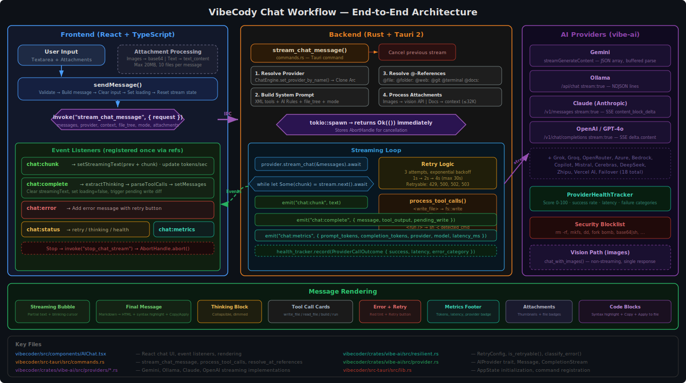

# Chat Workflow — End-to-End Architecture

This document traces a chat message from keypress to rendered response, covering the React frontend, Tauri IPC bridge, Rust backend, AI provider streaming, tool execution, and event-driven rendering.

---

## Architecture Diagram



> [Open in draw.io](chat-workflow.drawio) for editable version.

---

## Overview

```
User types message
       │
       ▼
┌─────────────────┐
│  AIChat.tsx     │  React component
│  sendMessage()  │
└───────┬─────────┘
        │ invoke("stream_chat_message", { request })
        ▼
┌─────────────────┐
│  commands.rs    │  Tauri command handler
│  stream_chat_   │
│  message()      │
└───────┬─────────┘
        │ tokio::spawn (async task)
        ▼
┌─────────────────┐
│  AIProvider     │  vibe-ai crate
│  stream_chat()  │  (Gemini, Ollama, Claude, OpenAI, ...)
└───────┬─────────┘
        │ SSE / streaming HTTP chunks
        ▼
┌─────────────────┐
│  Event emitter  │  app_handle.emit()
│  chat:chunk     │──► Frontend accumulates streamingText
│  chat:complete  │──► Frontend finalizes message
│  chat:error     │──► Frontend shows error
│  chat:status    │──► Frontend shows retry/thinking
│  chat:metrics   │──► Frontend shows token stats
└─────────────────┘
```

---

## 1. Frontend: User Input (`AIChat.tsx`)

### Entry point: `sendMessage()`

**File:** `vibeui/src/components/AIChat.tsx`

When the user presses Enter or clicks Send:

1. **Validate** — skip if input is empty and no attachments
2. **Build user message** — `{ role: "user", content, timestamp, attachments? }`
3. **Update state** — append to `messages`, clear input, reset streaming state
4. **Log to FlowContext** — for activity feed
5. **Invoke Tauri command:**

```typescript
await invoke("stream_chat_message", {
  request: {
    messages: [...messages, userMessage],
    provider: "gemini-2.5-flash",     // selected provider name
    context: editorContent,            // current file content
    file_tree: ["src/main.rs", ...],   // workspace file list
    current_file: "src/main.rs",       // active editor file
    mode: "chat" | "planning",        // backend mode
    attachments: [                     // files attached via drag/drop/paste
      { name, mime_type, data, size, text_content }
    ],
  },
});
```

### Attachment handling

- **Images** (png/jpg/gif/webp): Base64-encoded in `data` field, sent via vision API
- **Text/code files** (rs/ts/py/json/...): Read as text into `text_content`, injected as prompt context
- **Binary files**: Base64-encoded, displayed as `[Binary file]` placeholder
- **Limits**: 20 MB per file, 10 files max

---

## 2. Backend: Request Processing (`commands.rs`)

**File:** `vibeui/src-tauri/src/commands.rs` — `stream_chat_message()`

### 2a. Cancel previous stream

```rust
let mut handle = state.chat_abort_handle.lock().await;
if let Some(h) = handle.take() { h.abort(); }
```

Any in-flight stream is aborted to prevent interleaved responses.

### 2b. Resolve provider

```rust
let provider = {
    let mut engine = state.chat_engine.lock().await;
    engine.set_provider_by_name(&request.provider)?;
    engine.active_provider()?.clone()
};
```

The `ChatEngine` (from `vibe-ai`) manages provider instances. The provider `Arc<dyn AIProvider>` is cloned so the engine lock can be released before spawning the async task.

### 2c. Build system prompt

The system message is constructed with:

1. **Base instructions** — XML tool tags (`<write_file>`, `<read_file>`, `<list_dir>`, `<build />`, `<run />`)
2. **AI Rules** — from `.vibe/rules.md` or `.vibeui/rules.md` in workspace
3. **File tree** — list of workspace files for context
4. **Mode-specific** — planning mode adds "do NOT write code directly" instructions

### 2d. Resolve @-references

The last user message is scanned for `@` context references:

| Pattern | Action |
|---------|--------|
| `@file:src/main.rs` | Read file, inject as fenced code block |
| `@file:src/main.rs:10-30` | Read lines 10-30 only |
| `@folder:src/` | List directory tree |
| `@web:https://...` | Fetch URL, strip HTML, inject text |
| `@git` | Inject recent `git log` and `git diff` |
| `@terminal` | Inject last 50 terminal output lines |
| `@docs:query` | Search local docs index |

Resolved content is injected as a `[Context]` user message after the system prompt.

### 2e. Process attachments

Attachments are split into two categories:

- **Images** → `Vec<ImageAttachment>` for `chat_with_images()` vision API
- **Documents/code** → text content prepended to the last user message as `[Attached Documents]`

Large documents are truncated at 32K characters.

### 2f. Spawn streaming task

```rust
let join_handle = tokio::spawn(async move {
    // ... streaming logic
});
// Store abort handle for stop_chat_stream
*handle = Some(join_handle.abort_handle());
```

The command returns `Ok(())` immediately. The streaming task runs independently.

---

## 3. Streaming: Provider Communication

### 3a. Vision path (images attached)

If the message includes images and the provider supports vision:

```rust
provider.chat_with_images(&messages, &image_attachments, None).await
```

This is **non-streaming** (most providers don't stream vision). The full response is emitted as a single `chat:chunk` followed by `chat:complete`.

### 3b. Text streaming path (normal)

```rust
let mut stream = provider.stream_chat(&messages).await?;
while let Some(chunk) = stream.next().await {
    match chunk {
        Ok(text) => {
            accumulated.push_str(&text);
            app_handle.emit("chat:chunk", text);
        }
        Err(e) => { /* retry or emit chat:error */ }
    }
}
```

**Provider implementations:**

| Provider | Transport | Stream Format |
|----------|-----------|---------------|
| **Gemini** | `POST /v1beta/models/{model}:streamGenerateContent` | JSON array `[{candidates:[{content:{parts:[{text}]}}]},...]` — buffered and parsed incrementally |
| **Ollama** | `POST /api/chat` with `stream: true` | NDJSON lines `{"message":{"content":"..."}}` |
| **Claude** | `POST /v1/messages` with `stream: true` | SSE `event: content_block_delta` with `delta.text` |
| **OpenAI** | `POST /v1/chat/completions` with `stream: true` | SSE `data: {"choices":[{"delta":{"content":"..."}}]}` |

### 3c. Retry logic

Uses `RetryConfig` (default: 3 attempts, exponential backoff 1s → 4s → 16s, max 30s):

```
Attempt 1 → fail (retryable) → emit chat:status{type:"retry", attempt:2}
  → backoff 1s
Attempt 2 → fail (retryable) → emit chat:status{type:"retry", attempt:3}
  → backoff 2s
Attempt 3 → fail → emit chat:error
```

Retryable errors: rate limits (429), server errors (500/502/503), timeouts, connection resets.

### 3d. Provider health tracking

Every call outcome is recorded in `ProviderHealthTracker`:

```rust
health_tracker.record(ProviderCallOutcome {
    provider_name, success, latency, timestamp, error_category
});
```

Health scores (0-100) influence the status bar display and failover decisions.

---

## 4. Tool Execution (`process_tool_calls`)

After streaming completes, the accumulated response is scanned for XML tool tags:

### Supported tools

| Tag | Action |
|-----|--------|
| `<read_file path="..." />` | Read file via workspace FileSystem |
| `<write_file path="...">content</write_file>` | Write file to disk (creates parent dirs) |
| `<list_dir path="..." />` | List directory entries |
| `<build />` or `<build command="..." />` | Auto-detect build system or run custom command |
| `<run />` or `<run command="..." />` | Auto-detect run command or run custom command |
| `` ```path/to/file.ext `` (fenced code block) | Fallback: write code block content to file path |

### Security

Commands extracted from AI responses are checked against a blocklist:

```
rm -rf /, mkfs, dd if=, :(){ :|:& };:, poweroff, reboot,
chmod -R 777 /, curl -d, wget --post-data, base64 -d|sh, ...
```

Blocked commands produce a warning instead of executing.

### Build system auto-detection

Checks workspace for: `Cargo.toml` → `cargo build`, `package.json` → `npm run build`, `Makefile` → `make`, `go.mod` → `go build`, `pom.xml` → `mvn package`, etc.

### Output

Tool execution produces:
- `tool_output: String` — concatenated results of all tool calls
- `pending_write: Option<PendingWrite>` — last written file (for diff preview)

---

## 5. Event Flow: Backend → Frontend

### Events emitted by the backend

| Event | Payload | When |
|-------|---------|------|
| `chat:chunk` | `String` (text fragment) | Each streaming token/chunk |
| `chat:complete` | `ChatResponse { message, tool_output, pending_write }` | Stream finished + tools processed |
| `chat:error` | `String` (error message) | Unrecoverable error |
| `chat:status` | `{ type, ... }` | Retry, thinking, provider health |
| `chat:metrics` | `{ prompt_tokens, completion_tokens, provider, model, latency_ms }` | After completion |

### `chat:status` subtypes

| `type` | Fields | Meaning |
|--------|--------|---------|
| `retry` | `attempt`, `max`, `backoff_ms` | Retrying after transient failure |
| `thinking` | `active: bool` | Model is inside `<thinking>` block |
| `provider_health` | `provider`, `score`, `success_rate`, `recent_failures` | Health status at stream start |

---

## 6. Frontend: Event Handling (`AIChat.tsx`)

Event listeners are registered **once on mount** via a `useEffect` with stable refs (to avoid the re-registration race condition that caused responses to disappear — see commit `4358d0c`).

### `chat:chunk` handler

```typescript
listen<string>("chat:chunk", (e) => {
    setStreamingText((prev) => prev + e.payload);
    // Update tokens/sec estimate
});
```

The streaming text is displayed in a dedicated "streaming message" bubble with a blinking cursor.

### `chat:complete` handler

```typescript
listen<ChatResponse>("chat:complete", (e) => {
    const [content, thinking] = extractThinking(response.message);
    const [final, toolCalls] = parseToolCalls(content);
    setMessages((prev) => [...prev, { role: "assistant", content: final, thinking, toolCalls }]);
    setStreamingText("");   // clear streaming bubble
    setIsLoading(false);    // hide loading state
    // Trigger pending write diff preview if applicable
});
```

### `chat:error` handler

```typescript
listen<string>("chat:error", (e) => {
    setMessages((prev) => [...prev, { role: "assistant", content: e.payload, isError: true }]);
    setIsLoading(false);
});
```

### `chat:status` handler

- **retry** → resets `streamingText`, shows retry indicator
- **thinking** → shows "Thinking..." in status bar
- **provider_health** → shows health score badge

---

## 7. Message Rendering

### Message types

| Field | Rendering |
|-------|-----------|
| `content` | Markdown → rendered HTML (code blocks with syntax highlighting, copy buttons) |
| `thinking` | Collapsible "Thinking" block (dimmed, italic) |
| `toolCalls` | Expandable tool call cards with status badges |
| `isError` | Red-tinted error message with retry button |
| `attachments` | Thumbnail previews for images, file badges for documents |
| `metrics` | Token count, latency, provider badge in message footer |

### Code blocks

Code blocks in assistant messages get:
- Syntax highlighting (via Monaco tokenizer)
- **Copy** button
- **Apply** button (writes to file via `onPendingWrite`) — opens diff preview
- Language label badge

### Streaming bubble

While `isLoading && streamingText`:
- Shows partial response with blinking cursor
- Thinking blocks detected in real-time
- Tokens/sec counter in status bar
- **Stop** button to abort via `stop_chat_stream`

---

## 8. Stop / Cancel

```typescript
const stopMessage = useCallback(async () => {
    cancelledRef.current = true;
    await invoke("stop_chat_stream");
    // If there's partial streaming text, save it as a message
    if (streamingText) {
        setMessages((prev) => [...prev, { role: "assistant", content: streamingText }]);
    }
    setIsLoading(false);
});
```

Backend: `stop_chat_stream` aborts the `tokio::spawn` task via the stored `AbortHandle`.

---

## 9. Retry

The retry button on error messages calls `sendMessage(lastUserMessage.content)`, which re-enters the entire flow from step 1.

---

## Sequence Diagram

```
User          AIChat.tsx       Tauri IPC        commands.rs          Provider API
 │                │                │                │                    │
 │─ type msg ────►│                │                │                    │
 │                │─ setMessages ─►│                │                    │
 │                │─ setLoading ──►│                │                    │
 │                │                │                │                    │
 │                │── invoke ─────►│── stream_ ────►│                    │
 │                │  stream_chat_  │  chat_message  │                    │
 │                │  message       │                │                    │
 │                │                │                │─ set_provider ────►│
 │                │                │                │─ build_system_prompt│
 │                │                │                │─ resolve_@_refs    │
 │                │                │                │─ process_attachments│
 │                │                │                │                    │
 │                │◄─ Ok(()) ─────│◄───────────────│  (returns immediately)
 │                │                │                │                    │
 │                │                │                │── tokio::spawn ───►│
 │                │                │                │                    │
 │                │                │                │   ┌─ stream_chat() │
 │                │                │                │   │                │
 │                │                │  chat:chunk ◄──│◄──┤ "Here is"     │
 │  streaming ◄───│◄───────────────│                │   │                │
 │  text shows    │                │  chat:chunk ◄──│◄──┤ " the code"   │
 │                │                │                │   │                │
 │                │                │  chat:chunk ◄──│◄──┤ "\n```rust"   │
 │                │                │                │   │                │
 │                │                │                │   └─ stream ends   │
 │                │                │                │                    │
 │                │                │                │── process_tool_calls()
 │                │                │                │   ├─ <write_file> → fs::write
 │                │                │                │   ├─ <read_file>  → fs::read
 │                │                │                │   └─ <build />    → sh -c "cargo build"
 │                │                │                │                    │
 │                │                │  chat:complete◄│                    │
 │  final msg ◄───│◄───────────────│  { message,    │                    │
 │  rendered      │                │    tool_output, │                    │
 │                │                │    pending_write}│                    │
 │                │                │                │                    │
 │                │                │  chat:metrics ◄│                    │
 │  token stats ◄─│◄───────────────│  { tokens,     │                    │
 │                │                │    latency_ms } │                    │
```

---

## Key Files

| File | Role |
|------|------|
| `vibeui/src/components/AIChat.tsx` | React chat UI, event listeners, message rendering |
| `vibeui/src/components/AIChat.css` | Chat styling (dark theme, code blocks, streaming cursor) |
| `vibeui/src-tauri/src/commands.rs` | `stream_chat_message`, `send_chat_message`, `process_tool_calls`, `resolve_at_references` |
| `vibeui/src-tauri/src/lib.rs` | AppState initialization, command registration |
| `vibeui/crates/vibe-ai/src/provider.rs` | `AIProvider` trait, `Message`, `CompletionStream` |
| `vibeui/crates/vibe-ai/src/providers/gemini.rs` | Gemini streaming implementation |
| `vibeui/crates/vibe-ai/src/providers/ollama.rs` | Ollama streaming implementation |
| `vibeui/crates/vibe-ai/src/resilient.rs` | `RetryConfig`, `is_retryable()`, `classify_error()` |

---

## Known Issues & Mitigations

| Issue | Mitigation |
|-------|-----------|
| Event listeners re-registering mid-stream (responses disappearing) | Fixed in `4358d0c`: `onFileAction`/`onPendingWrite` stored in refs, effect runs once on mount |
| Gemini streaming splits JSON mid-object | Buffered parser with balanced-brace extraction (`extract_json_object`) |
| Provider returns empty response | `chat:complete` still fires; empty message appears as blank bubble |
| Long responses truncate | No hard limit on accumulated text; browser may slow on very large DOM |
| Concurrent stream cancellation | `chat_abort_handle` ensures only one stream runs at a time |
